# Microsoft Cloud Product Icons

A curated collection of **official SVG and PNG icons** for Microsoft Cloud products.
One icon per product — clean, consistent, ready to use.

**👉 [Browse the icon collection live](https://damobird365.github.io/microsoft-cloud-icons/)**

**72 product icons** across **9 categories**

## Quick Reference

| Category | Icons | Products |
|----------|-------|----------|
| Microsoft 365 | 25 | Word, Excel, PowerPoint, Outlook, OneNote, Teams, SharePoint, OneDrive, Access, Publisher, Visio, Project, Loop, Lists, Forms, Planner, Stream, Clipchamp, Sway, Bookings, To Do, Whiteboard, Delve, Places, Microsoft 365 |
| Power Platform | 12 | Power Apps, Power Automate, Power BI, Power Pages, Power Platform, Copilot Studio, AI Builder, Dataverse, Power Fx, Connectors, Agent 365, Agent Builder |
| Dynamics 365 | 13 | Dynamics 365, Business Central, Customer Service, Field Service, Finance, Sales, Supply Chain Management, Commerce, Remote Assist, Guides, Customer Voice, Project Operations, Fraud Protection |
| Entra | 4 | Microsoft Entra, Entra ID, Entra ID Governance, Entra Verified ID |
| Viva | 8 | Viva Connections, Viva Insights, Viva Learning, Viva Engage, Viva Pulse, Viva Amplify, Viva Glint, Viva Suite |
| Security | 2 | Defender, Purview |
| Copilot | 1 | Microsoft Copilot |
| Fabric | 1 | Microsoft Fabric |
| Other | 6 | Microsoft Edge, Bing, Designer, Office, Microsoft Foundry, Family Safety |

## All Icons

### Microsoft 365

| Icon | Product | File |
|------|---------|------|
| 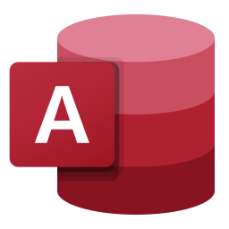 | **Access** | `icons/microsoft-365/access.svg` |
| 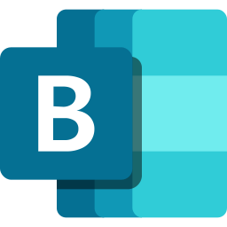 | **Bookings** | `icons/microsoft-365/bookings.svg` |
| 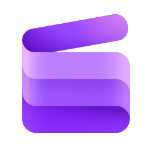 | **Clipchamp** | `icons/microsoft-365/clipchamp.svg` |
| 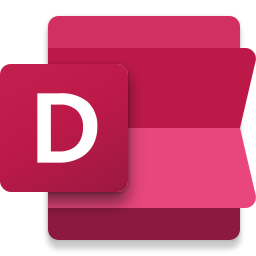 | **Delve** | `icons/microsoft-365/delve.svg` |
| 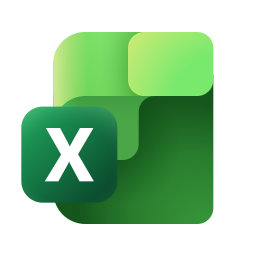 | **Excel** | `icons/microsoft-365/excel.svg` |
| 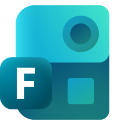 | **Forms** | `icons/microsoft-365/forms.svg` |
| 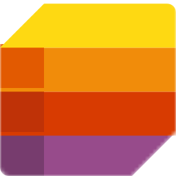 | **Lists** | `icons/microsoft-365/lists.svg` |
| 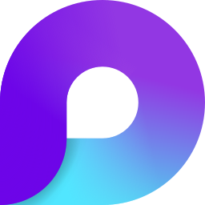 | **Loop** | `icons/microsoft-365/loop.svg` |
| 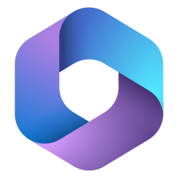 | **Microsoft 365** | `icons/microsoft-365/microsoft-365.svg` |
| 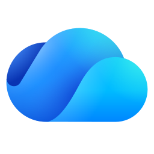 | **OneDrive** | `icons/microsoft-365/onedrive.svg` |
| 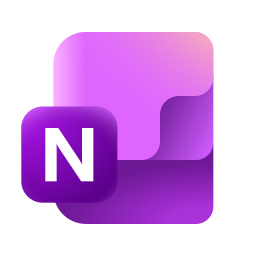 | **OneNote** | `icons/microsoft-365/onenote.svg` |
| 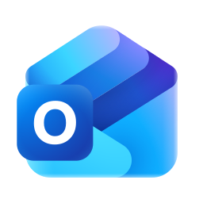 | **Outlook** | `icons/microsoft-365/outlook.svg` |
| 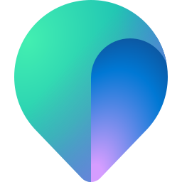 | **Places** | `icons/microsoft-365/places.svg` |
| 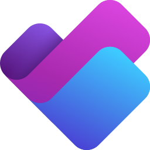 | **Planner** | `icons/microsoft-365/planner.svg` |
| 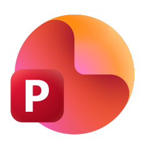 | **PowerPoint** | `icons/microsoft-365/powerpoint.svg` |
| 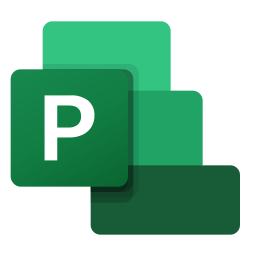 | **Project** | `icons/microsoft-365/project.svg` |
|  | **Publisher** | `icons/microsoft-365/publisher.svg` |
| 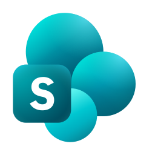 | **SharePoint** | `icons/microsoft-365/sharepoint.svg` |
|  | **Stream** | `icons/microsoft-365/stream.svg` |
| 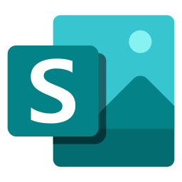 | **Sway** | `icons/microsoft-365/sway.svg` |
|  | **Teams** | `icons/microsoft-365/teams.svg` |
|  | **To Do** | `icons/microsoft-365/to-do.svg` |
| 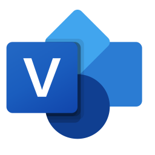 | **Visio** | `icons/microsoft-365/visio.svg` |
|  | **Whiteboard** | `icons/microsoft-365/whiteboard.svg` |
|  | **Word** | `icons/microsoft-365/word.svg` |

### Power Platform

| Icon | Product | File |
|------|---------|------|
|  | **Agent 365** | `icons/power-platform/agent-365.svg` |
| 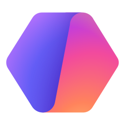 | **Agent Builder** | `icons/power-platform/agent-builder.svg` |
| 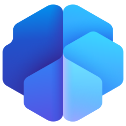 | **AI Builder** | `icons/power-platform/ai-builder.svg` |
| 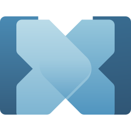 | **Connectors** | `icons/power-platform/connectors.svg` |
| 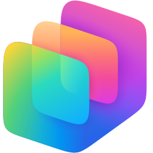 | **Copilot Studio** | `icons/power-platform/copilot-studio.svg` |
| 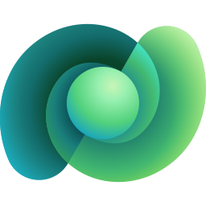 | **Dataverse** | `icons/power-platform/dataverse.svg` |
| 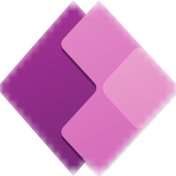 | **Power Apps** | `icons/power-platform/power-apps.svg` |
|  | **Power Automate** | `icons/power-platform/power-automate.svg` |
|  | **Power BI** | `icons/power-platform/power-bi.svg` |
| 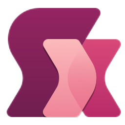 | **Power Fx** | `icons/power-platform/power-fx.svg` |
| 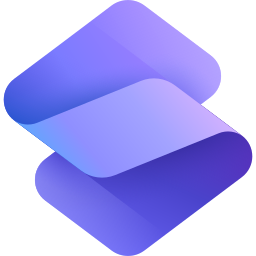 | **Power Pages** | `icons/power-platform/power-pages.svg` |
| 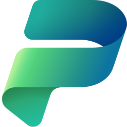 | **Power Platform** | `icons/power-platform/power-platform.svg` |

### Dynamics 365

| Icon | Product | File |
|------|---------|------|
| 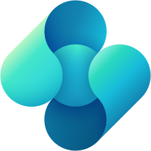 | **Business Central** | `icons/dynamics-365/business-central.svg` |
|  | **Commerce** | `icons/dynamics-365/commerce.svg` |
| 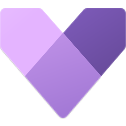 | **Customer Service** | `icons/dynamics-365/customer-service.svg` |
| 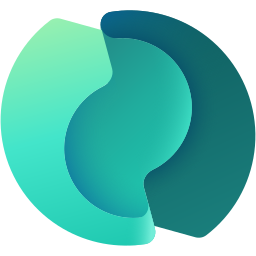 | **Customer Voice** | `icons/dynamics-365/customer-voice.svg` |
| 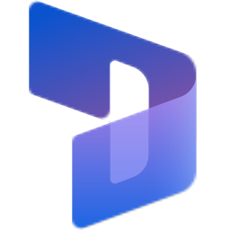 | **Dynamics 365** | `icons/dynamics-365/dynamics-365.svg` |
|  | **Field Service** | `icons/dynamics-365/field-service.svg` |
|  | **Finance** | `icons/dynamics-365/finance.svg` |
|  | **Fraud Protection** | `icons/dynamics-365/fraud-protection.svg` |
| 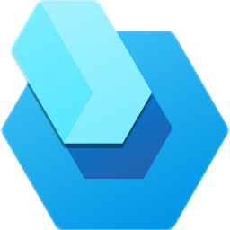 | **Guides** | `icons/dynamics-365/guides.svg` |
| 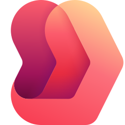 | **Project Operations** | `icons/dynamics-365/project-operations.svg` |
| 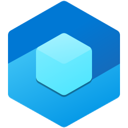 | **Remote Assist** | `icons/dynamics-365/remote-assist.svg` |
| 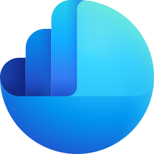 | **Sales** | `icons/dynamics-365/sales.svg` |
| 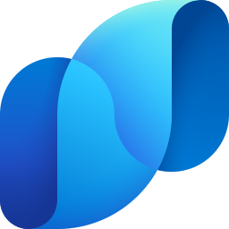 | **Supply Chain Management** | `icons/dynamics-365/supply-chain.svg` |

### Entra

| Icon | Product | File |
|------|---------|------|
|  | **Entra ID** | `icons/entra/entra-id.svg` |
|  | **Entra ID Governance** | `icons/entra/entra-id-governance.svg` |
|  | **Entra Verified ID** | `icons/entra/entra-verified-id.svg` |
| 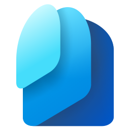 | **Microsoft Entra** | `icons/entra/entra.svg` |

### Viva

| Icon | Product | File |
|------|---------|------|
|  | **Viva Amplify** | `icons/viva/viva-amplify.svg` |
| 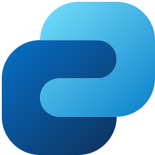 | **Viva Connections** | `icons/viva/viva-connections.svg` |
|  | **Viva Engage** | `icons/viva/viva-engage.svg` |
| 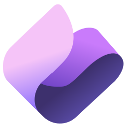 | **Viva Glint** | `icons/viva/viva-glint.svg` |
| 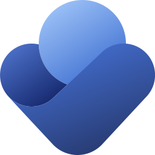 | **Viva Insights** | `icons/viva/viva-insights.svg` |
| 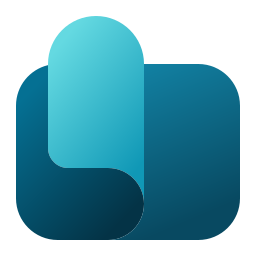 | **Viva Learning** | `icons/viva/viva-learning.svg` |
|  | **Viva Pulse** | `icons/viva/viva-pulse.svg` |
|  | **Viva Suite** | `icons/viva/viva-suite.svg` |

### Security

| Icon | Product | File |
|------|---------|------|
|  | **Defender** | `icons/security/defender.svg` |
|  | **Purview** | `icons/security/purview.svg` |

### Copilot

| Icon | Product | File |
|------|---------|------|
| 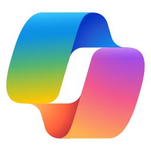 | **Microsoft Copilot** | `icons/copilot/copilot.svg` |

### Fabric

| Icon | Product | File |
|------|---------|------|
| 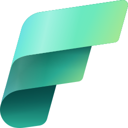 | **Microsoft Fabric** | `icons/fabric/fabric.svg` |

### Other

| Icon | Product | File |
|------|---------|------|
|  | **Bing** | `icons/other/bing.svg` |
|  | **Designer** | `icons/other/designer.svg` |
|  | **Family Safety** | `icons/other/family-safety.svg` |
|  | **Microsoft Edge** | `icons/other/edge.svg` |
| 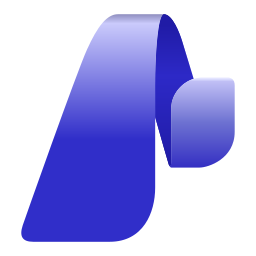 | **Microsoft Foundry** | `icons/other/foundry.svg` |
|  | **Office** | `icons/other/office.svg` |

---

## Adding New Icons

When adding a new product icon:

1. **SVG format** — save as `.svg` in the appropriate `icons/{category}/` folder
2. **Naming** — use kebab-case: `product-name.svg` (e.g. `power-apps.svg`)
3. **SVG size** — set `width="256" height="256"` on the `<svg>` tag, preserving the original `viewBox`
4. **PNG version** — create a 512×512 PNG with transparent background alongside the SVG
5. **Update index.html** — add an entry to the relevant category in the `CATEGORIES` array
6. **Description** — use [Microsoft Learn](https://learn.microsoft.com) as the source for product descriptions

## Trademark Notice

All logos and icons are the property of **Microsoft Corporation**.
See [Microsoft Trademark & Brand Guidelines](https://www.microsoft.com/en-us/legal/intellectualproperty/trademarks) before using.
